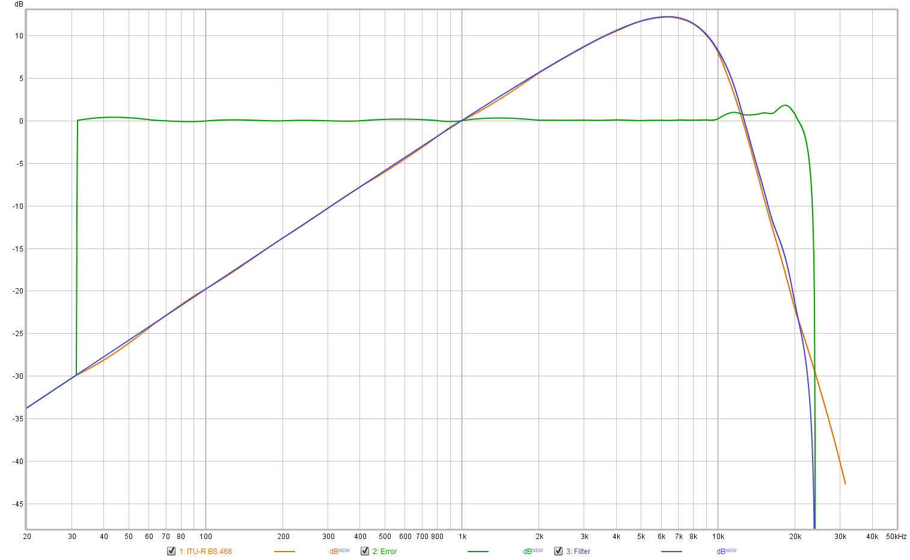

# [SoX][] cheat sheet

## Definition of *dBFS*

The definition of the *dBFS* unit of measurement is [notably ambiguous][dbFS],
especially when dealing with RMS quantities.

[AES17-2015][] 3.12.1 and [IEC 61606-3:2008][] 3.4 both define 0 dBFS as the RMS
amplitude of a full-scale sine wave.

The SoX `stats` filter uses a different definition, where the maximum sample
value is defined as 0 dB, and the RMS value is derived from that. Thus, a
full-scale sine wave has an RMS amplitude of -3 dB according to SoX:

```
$ sox --null --null synth 5 sine 997 stats
Pk lev dB      -0.00
RMS lev dB     -3.01
```

Thus, to get to the dBFS value, one must add 3.01 dB to the RMS level that SoX
reports.

## Generate REW-compatible WAV files

Use the `--type wavpcm` output option.

## Generate a Dirac Pulse (unit impulse response)

Especially useful to study the effects of a digital filter.

```
sox --null dirac.wav trim 0 1s dcshift 0.9 pad 1 1
```

## [ITU-R BS.468-4][] weighting filter

The following sox filter chain will closely match the filter specified in
BS.468:

```
sox ... --rate 48000 ... \
	$(./generate_fir_filter.py \
		--frequency-response-spec-file=./bs468.txt \
		--dc-gain-db=-Inf --nyquist-gain-db=-Inf --antisymmetric \
		--sample-rate-hz=48000 --taps=63 --print-sox-fir)
```



When using such a filter for [AES17-2015][]/[IEC 61606-3:2008][] measurements,
don't forget to add 5.6 dB of attenuation as specified in these standards:

```
gain -5.6
```

[AES17-2015]: http://www.aes.org/publications/standards/search.cfm?docID=21
[IEC 61606-3:2008]: https://webstore.iec.ch/publication/5666
[ITU-R BS.468-4]: https://www.itu.int/rec/R-REC-BS.468-4-198607-I
[SoX]: http://sox.sourceforge.net/
