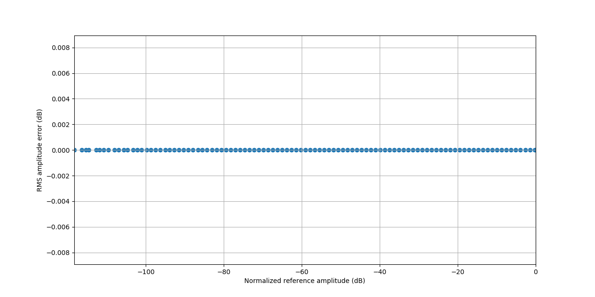
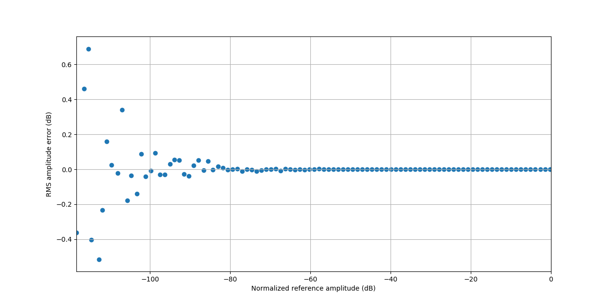
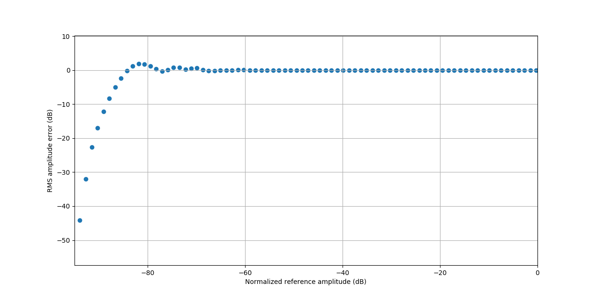

# [SoX][] cheat sheet

## Definition of *dBFS*

The definition of the *dBFS* unit of measurement is [notably ambiguous][dbFS],
especially when dealing with RMS quantities.

[AES17-2015][] 3.12.1 and [IEC 61606-3:2008][] 3.4 both define 0 dBFS as the RMS
amplitude of a full-scale sine wave.

The SoX `stats` filter uses a different definition, where the maximum sample
value is defined as 0 dB, and the RMS value is derived from that. Thus, a
full-scale sine wave has an RMS amplitude of -3 dB according to SoX:

```
$ sox --null --null synth 5 sine 997 stats
Pk lev dB      -0.00
RMS lev dB     -3.01
```

Thus, to get to the dBFS value, one must add 3.01 dB to the RMS level that SoX
reports.

## Generate REW-compatible WAV files

Use the `--type wavpcm` output option.

## Generate a Dirac Pulse (unit impulse response)

Especially useful to study the effects of a digital filter.

```
sox --null dirac.wav trim 0 1s dcshift 0.9 pad 1 1
```

## [ITU-R BS.468-4][] weighting filter

The following sox filter chain will closely match the filter specified in
BS.468:

```
sox ... --rate 48000 ... \
	$(./generate_fir_filter.py \
		--frequency-response-spec-file=./bs468.txt \
		--dc-gain-db=-Inf --nyquist-gain-db=-Inf --antisymmetric \
		--sample-rate-hz=48000 --taps=63 --print-sox-fir)
```


When using such a filter for [AES17-2015][]/[IEC 61606-3:2008][] measurements,
don't forget to add 5.6 dB of attenuation as specified in these standards:

```
gain -5.6
```

## [Dynamic range][] measurement

The following procedure is intended to measure dynamic range as defined in
[AES17-2015][] 6.4.1 and [IEC 61606-3:2008][] 6.2.3.3.

### Assumptions

- The EUT is reasonably linear up to 0 dBFS.
  - If it's not, AES17 and IEC 61606-3 diverge, because the AES17 6.2.1 *maximum
    input level* and *maximum output level*, used as reference levels, will be
	less than 0 dBFS. In contrast, IEC 61606-3 always uses a reference level of
	0 dBFS.
- The difference between the test signal frequency and the measured signal
  frequency is negligible.
  - If it's not, AES17 and IEC 61606-3 diverge, because AES17 specifies a notch
    filter set to the test signal frequency. In contrast, IEC 61606-3 5.6.3.1
	specifies an auto-tuning filter.
- The *upper band-edge frequency* is 20 kHz.

### Test signal

```
sox --null --bits 16 --rate 48000 997-60-16-48000.wav synth 30 sine 997 gain -60
```

### Measurement filter

The following filters should be applied on the measured signal:

- AES17 5.2.5 low-pass filter
- AES17 5.2.8 or IEC 61606-3 5.6.3.2.6 notch/band-reject filter
- AES17 5.2.7 or IEC 61606-3 5.6.3.2.9 weighting filter

The following command implements all of the above:

```
sox ... --null \
	rate -v 48000 \
	bandreject 997 2q \
	$(./generate_fir_filter.py \
		--frequency-response-spec-file=./bs468.txt \
		--dc-gain-db=-Inf --nyquist-gain-db=-Inf --antisymmetric \
		--sample-rate-hz=48000 --taps=63 --print-sox-fir) gain -5.6 \
	trim 1 -1 stats
```

Note: `trim 1 -1` removes invalid data at the beginning and end of the signal
that is caused by filter discontinuities. This invalid data can throw off the
final calculation.

### Interpreting the results

The `RMS lev dB` value from the above command shall be compared with the value
from a 997 Hz full-scale sine wave measurement. The difference between the two
is the dynamic range in *dB CCIR-RMS*.

For convenience, this value can be interpreted as a number of bits simply by
dividing by 6. (This is because adding one bit doubles the dynamic range, and
a factor of two is 6 dB.) For example, the dynamic range of TPDF-dithered
16/24-bit digital audio is 96/144 dB CCIR-RMS, and the above procedure will
confirm this. If sophisticated noise shaping is used instead of TPDF dither,
this measurement will reflect the improved perceived dynamic range thanks to the
weighting filter. For example, the measured value with SoX `dither -s -p 16` is
101 dB CCIR-RMS.

## THD+N vs output level measurement

The following procedure is intended to measure THD+N vs output level as defined
in [AES17-2015][] 6.3.4 and [IEC 61606-3:2008][] 6.2.2.3.

### Assumptions

- The difference between the test signal frequency and the measured signal
  frequency is negligible.
  - If it's not, AES17 and IEC 61606-3 diverge, because AES17 specifies a notch
    filter set to the test signal frequency. In contrast, IEC 61606-3 5.6.3.1
	specifies an auto-tuning filter.
- The *upper band-edge frequency* is 20 kHz.

### Test signal

```
sox --null --bits 16 --rate 48000 thdn-test.wav \
    synth 10 sine 997 \
    synth exp amod 0.1 0 0 0 40
```

### Recorded signal analysis

```
./correlate.py \
    --reference-wav-file=thdn-test.wav \
    --test-wav-file=thdn-recorded.wav \
    --aligned-wav-file=thdn-aligned.wav
sox thdn-aligned.wav --bits 32 thdn-filtered.wav \
    bandreject 997 3.1q bandreject 997 3.1q \
    remix 1 trim 0.02 -0.02
sox thdn-test.wav thdn-reference.wav trim 0.02 -0.02
./plot_amplitude.py \
    --reference-wav-file=thdn-reference.wav \
    --wav-file=thdn-filtered.wav \
    --relative --window-size-seconds=0.1 --against-normalized-amplitude \
    --x-label 'Normalized signal level (dB)' --y-label 'THD+N (dB)'
```

The above `plot_amplitude` command shows THD+N, relative to the total level of
the measured signal. To plot absolute N+D, remove `--relative`.

Note: `trim 0.02 -0.02` removes invalid data at the beginning and end of the
signal that is caused by filter discontinuities. This invalid data can cause
spurious outliers at the ends of the plot.

### Example results

Normal result where `thdn-recorded.wav` is a copy of `thdn-test.wav`:

```
sox thdn-test.wav thdn-recorded.wav
```


Performance in this example is limited by the 16-bit dithering noise floor of
the test signal.

## Linearity measurement

This procedure measures the amplitude linearity of the EUT; i.e. its low-level
signal accuracy. It is especially effective at catching broken digital audio
chains, especially dithering issues and poorly designed DACs.

This measurement can be seen as complementary to dynamic range measurements:
while dynamic range measurements throw out the test signal and focuses on the
noise, this linearity measurement does the exact opposite and throws out the
noise to focus on the test signal.

### Test signal

```
sox --null --bits 16 --rate 48000 linearity-test.wav \
    synth 100 sine 997 \
    synth exp amod 0.01 0 0 0 60
```

### Recorded signal analysis

```
sox linearity-test.wav --bits 32 linearity-reference.wav bandpass 997 200q bandpass 997 200q remix 1
sox linearity-recorded.wav --bits 32 linearity-filtered.wav bandpass 997 200q bandpass 997 200q remix 1
./correlate.py \
    --reference-wav-file=linearity-reference.wav \
    --test-wav-file=linearity-filtered.wav \
    --aligned-wav-file=linearity-aligned.wav
./plot_amplitude.py \
    --reference-wav-file=linearity-reference.wav \
    --wav-file=linearity-aligned.wav \
    --against-normalized-amplitude --relative --center --window-size-seconds=1
```

### Example results

Ideal result where `linearity-recorded.wav` is a copy of `linearity-test.wav`:

```
sox linearity-test.wav linearity-recorded.wav
```


Normal result where `linearity-recorded.wav` is a redithered copy of
`linearity-test.wav`. 

```
sox linearity-test.wav linearity-recorded.wav gain -1
```


Notice how the analyser can still resolve down to around -110 dBFS despite the
presence of additional 16-bit dithering noise.

Abnormal result where `linearity-recorded.wav` is a copy of `linearity-test.wav`
that went through a gain filter without being redithered afterwards:

```
sox linearity-test.wav --no-dither linearity-recorded.wav gain -10
```


### Adjusting the test parameters

- The test signal length determines time resolution. When changing the test
  signal duration, make sure to change the exponential amplitude modulation
  length by the inverse factor. For example, for a quicker 20-second test,
  change `100` to `20` and `0.01` to `0.05`.
- Use the `plot_amplitude --window-size-seconds` parameter to adjust the
  smoothing of the resulting plot. Higher values make for a more readable plot
  but hides uncertainty in the data points.
- The amplitude lower bound of the test signal is -120 dBFS in the command
  above. It is twice the parameter `60`. For example, to test down to -160 dBFS,
  change `60` to `80`.
- The purpose of the analysis band-pass filter is to fish the test signal out
  of the dithering noise, as well as any additional noise produced by the EUT.
  The filter parameters determine the lower amplitude bound at which the
  analyser itself "bottoms out" (i.e. becomes unable to distinguish the test
  signal from the surrounding noise). That limit appears as a vertical
  "hockey stick" on the left of the resulting plot. The above command is able to
  resolve down to around 15 dB below a TPDF dither noise floor; so, for example,
  it can measure down to around -110 dBFS (~18 bits) in the presence of 16-bit
  dithering noise. The absolute limit of the analyser is around -160 dBFS,
  presumably due to computation accuracy.

[AES17-2015]: http://www.aes.org/publications/standards/search.cfm?docID=21
[dbFS]: https://en.wikipedia.org/wiki/DBFS#RMS_levels
[dither]: https://en.wikipedia.org/wiki/Dither
[dynamic range]: https://en.wikipedia.org/wiki/Dynamic_range#Audio
[IEC 61606-3:2008]: https://webstore.iec.ch/publication/5666
[ITU-R BS.468-4]: https://www.itu.int/rec/R-REC-BS.468-4-198607-I
[SoX]: http://sox.sourceforge.net/
